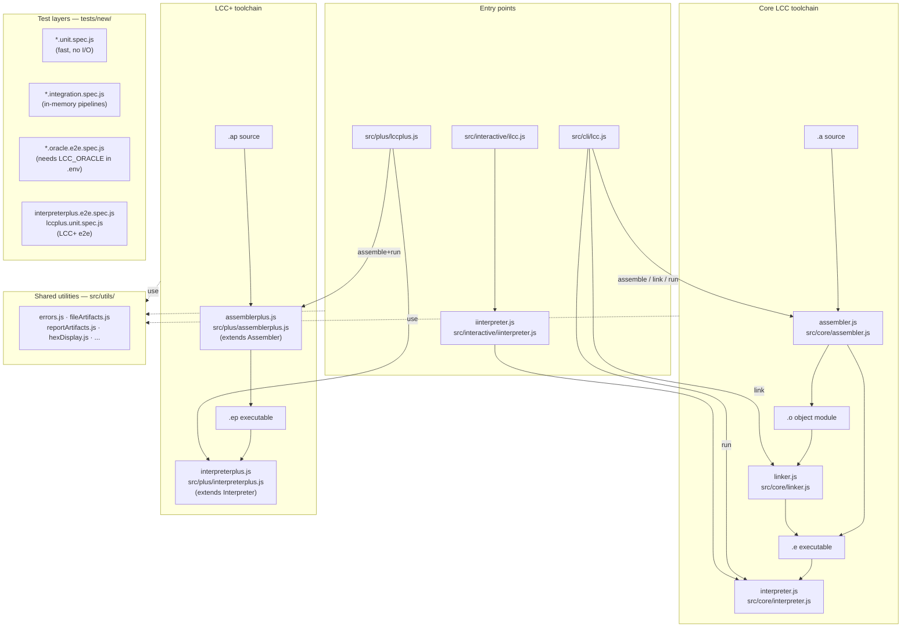
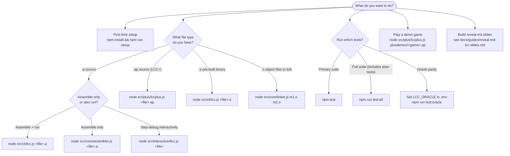

# LCCjs Orientation

Two-minute orientation for new contributors: what the repo contains, how its components relate, and which command to reach for.

---

## Architecture Diagram

LCCjs ships two parallel toolchains. The file extension you start with determines which one applies.

### Key directories at a glance

| Directory | Contents |
|---|---|
| `src/core/` | Assembler, linker, interpreter — the pure in-memory APIs |
| `src/plus/` | AssemblerPlus + InterpreterPlus (subclass core), `lccplus.js` CLI |
| `src/cli/` | `lcc.js` — orchestration only (option parsing, assemble/link/run dispatch) |
| `src/interactive/` | `-i` step-debugger (`ilcc.js` + `iinterpreter.js`) |
| `src/utils/` | Shared concerns: typed errors, artifact naming, hex display, report generation |
| `src/browser/` | Webpack bundle API (`api.js`, `lcc-worker.js`, `lcc-injector.js`) |
| `src/extra/` | Optional tools: `disassembler.js`, `linkerStepsPrinter.js` |
| `tests/new/` | All test suites (unit, integration, oracle e2e, LCC+ e2e) |
| `plusdemos/` | Playable `.ap` demo programs (snake, flappy bird, tic-tac-toe, …) |

---

## User-Flow Decision Tree

### Quick-reference command table

| Goal | Command |
|---|---|
| First-time setup | `npm install && npm run setup` |
| Assemble + run a `.a` file | `node src/cli/lcc.js <file>.a` |
| Assemble only | `node src/core/assembler.js <file>.a` |
| Run a pre-built `.e` binary | `node src/cli/lcc.js <file>.e` |
| Link object files | `node src/core/linker.js m1.o m2.o` |
| Assemble + run a `.ap` file (LCC+) | `node src/plus/lccplus.js <file>.ap` |
| Step-debug interactively (TUI) | `node src/cli/lcc.js -i <file>` (or `ilcc.js <file>`) |
| Step-debug, OG/textbook style | `node src/cli/lcc.js -d <file>.e` |
| Learn the two debuggers (`-d` vs `-i`) | see `docs/guides/debuggers.md` |
| Play a demo game | `node src/plus/lccplus.js plusdemos/<game>.ap` |
| Run primary test suite | `npm test` |
| Run full test suite (slow) | `npm run test:all` |
| Run oracle parity tests | set `LCC_ORACLE` in `.env`, then `npm run test:oracle` |
| Create reveal-md slides with live LCC code blocks | see `docs/guides/reveal-md-lcc-slides.md` |
